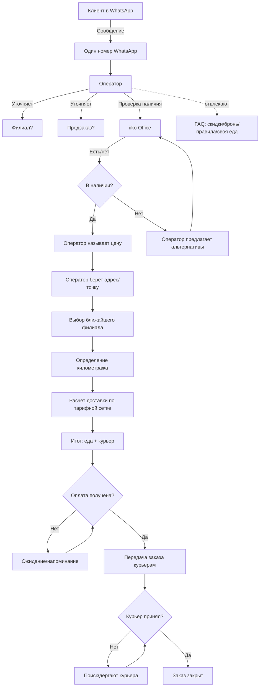

```mermaid
graph TD;
    Client[Клиент в WhatsApp] -->|Сообщение| WA[Один номер WhatsApp];
    WA --> OP[Оператор];

    OP -->|Уточняет| BranchQ[Филиал?];
    OP -->|Уточняет| PreQ[Предзаказ?];

    OP -->|Проверка наличия| IIKO[iiko Office];
    IIKO -->|Есть/нет| Stock{В наличии?};

    Stock -->|Да| Price[Оператор называет цену];
    Stock -->|Нет| Alt[Оператор предлагает альтернативы];
    Alt --> IIKO;

    Price --> Addr[Оператор берет адрес/точку];
    Addr --> BranchPick[Выбор ближайшего филиала];
    BranchPick --> Km[Определение километража];
    Km --> Fee[Расчет доставки по тарифной сетке];
    Fee --> Bill[Итог: еда + курьер];
    Bill --> Pay{Оплата получена?};
    Pay -->|Нет| Wait[Ожидание/напоминание];
    Wait --> Pay;
    Pay -->|Да| Courier[Передача заказа курьерам];
    Courier --> Ack{Курьер принял?};
    Ack -->|Нет| Follow[Поиск/дергают курьера];
    Follow --> Ack;
    Ack -->|Да| Done[Заказ закрыт];

    OP -. отвлекают .-> FAQ[FAQ: скидки/бронь/правила/своя еда];
```
